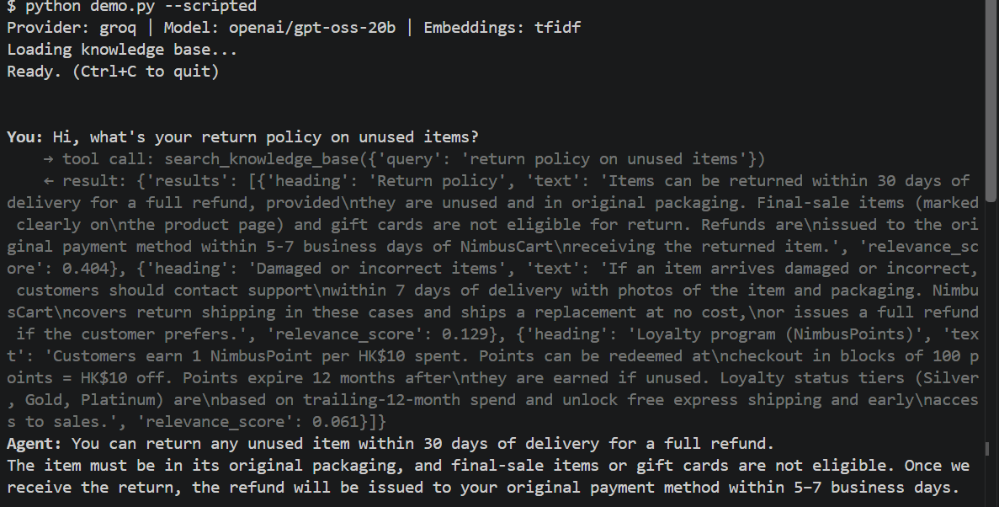
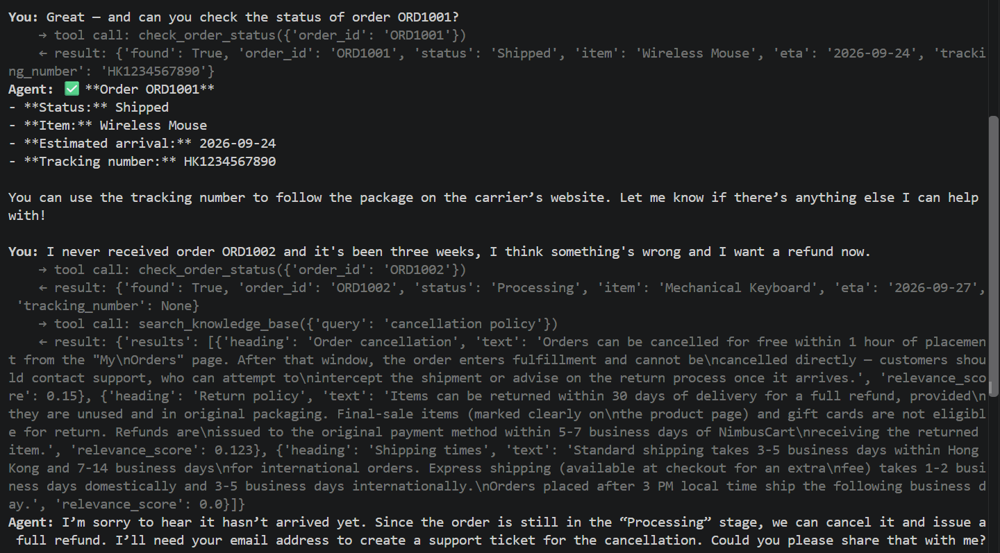

# NimbusCart Support Agent

A small agentic customer-support assistant built to demonstrate the core pattern
behind production AI agents: an LLM that autonomously decides, per turn, whether
to retrieve knowledge, call a backend tool, or just answer — rather than a fixed
RAG pipeline that always retrieves, or a chatbot that can only talk.

Built as a practical exercise in the same problem space as enterprise customer-
communication automation: retrieving from a knowledge base, calling real APIs,
and escalating to a human when the agent shouldn't guess.

**Runs for $0.** It defaults to Groq's free API tier — no credit card, just an
email sign-up — and can also run entirely on your own machine via Ollama with
no API key at all. Anthropic's Claude API is supported too if you'd rather pay
for Claude's quality specifically, but it's optional, not required.

## What it does

NimbusCart is a fictional e-commerce company. The agent can:

- **Answer policy questions** (shipping, returns, exchanges, payments, cancellations,
  loyalty program) by retrieving the relevant chunk from a knowledge base — it does
  not answer these from the model's own guesses.
- **Look up a specific order** by ID (status, ETA, tracking number) via a mock
  orders API.
- **Escalate to a human** by filing a support ticket when a request is outside
  what it can resolve (disputes, fraud, anything the policy doesn't cover).

The model decides which of these to do — including doing more than one in a
single turn, e.g. "where's my order AND what's your return policy if it's late."

## Architecture

```
                     ┌─────────────────────────┐
   user message ───► │   SupportAgent.send()    │
                     │  (agent/core.py)         │
                     └─────────────┬────────────┘
                                   │
                    model decides: answer directly,
                    or call one or more tools
                                   │
                 ┌─────────────────┼─────────────────┐
                 ▼                 ▼                 ▼
     search_knowledge_base  check_order_status  create_support_ticket
       (agent/retriever.py)   (agent/mock_backend.py)  (agent/mock_backend.py)
                 │                 │                 │
        TF-IDF or sentence-   in-memory mock     appends to
        transformer chunks    orders dict        data/tickets.json
                 │                 │                 │
                 └─────────────────┼─────────────────┘
                                   ▼
                    tool result fed back to the model,
                    loop repeats until it answers in plain text
```

This is a hand-rolled [ReAct](https://arxiv.org/abs/2210.03629)-style loop — no
LangChain/LlamaIndex/CrewAI. That's deliberate: the whole loop is under 60 lines
(`agent/core.py`), and understanding it end to end makes picking a framework
later a matter of convenience, not a black box you're trusting blindly.

**One more layer worth knowing about:** `agent/providers.py` normalizes three
different LLM wire formats (Anthropic's native format, and the OpenAI-compatible
format that Groq/Ollama/OpenAI all share) into one shape, so `core.py`'s agent
loop doesn't know or care which provider is actually answering. Swapping
providers is a one-line environment variable change, not a rewrite.

## Setup 

```bash
git clone <this-repo>
cd support-agent
pip install -r requirements.txt
cp .env.example .env
```

Then get a free Groq API key (no credit card): go to
https://console.groq.com, sign up with an email, create an API key, and paste
it into `.env` as `GROQ_API_KEY`. That's it — the default `.env.example`
already points at Groq's `openai/gpt-oss-20b`, which supports tool
calling well.

### Fully local alternative (no API key, no internet after setup)

```bash
# install from https://ollama.com, then:
ollama pull llama3.1
```

Set `AGENT_PROVIDER=ollama` in `.env` (no key needed) and run as normal — the
agent talks to your local Ollama server instead of any cloud API.

### If you'd rather use Claude

Set `AGENT_PROVIDER=anthropic` and `ANTHROPIC_API_KEY` in `.env`. This costs
money past any trial credit Anthropic gives new accounts — see
https://console.anthropic.com for current terms.

Free-tier limits and model line-ups change over time for every provider above
— check their docs if something stops working.

## Running it

```bash
# Interactive chat
python demo.py

```
## Demo

The agent autonomously decides which tool to use based on the question:

**Screenshot 1: Policy retrieval**



The agent retrieves the return policy from the knowledge base.

**Screenshot 2: Order lookup + Smart escalation**


The agent checks order status in a single conversation. When a customer's issue is outside policy (a 3-week delay with no tracking), the agent recognizes it needs human intervention and asks for contact info to file a support ticket.

## Retrieval: two backends, same interface

By default `EMBEDDING_BACKEND=tfidf` — scikit-learn TF-IDF + cosine similarity.
No network access or model download needed, which makes it easy to run
anywhere immediately (including this repo's test suite, which needs no API
key or internet access at all).

Set `EMBEDDING_BACKEND=sentence-transformers` for real semantic embeddings
(via a local Chroma collection) — meaningfully better at matching paraphrases
("money back" → the refund policy chunk, even though that chunk never says
"money back"). This downloads a small model from Hugging Face on first run.
Requires `chromadb` and `sentence-transformers` (see `requirements.txt`).

Swapping backends is a one-line env var change — `agent/retriever.py`'s
`get_retriever()` is the only thing that branches on it.

## Tests

The retriever, mock backend, tool dispatch, and the Groq/Ollama/OpenAI wire
format translation are fully unit-tested with no API key or network access
required:

```bash
python -m pytest tests/ -v
```

## Project structure

```
support-agent/
├── agent/
│   ├── config.py         # env-var driven configuration, provider defaults
│   ├── providers.py       # normalizes Anthropic vs. OpenAI-compatible wire formats
│   ├── retriever.py        # RAG: chunking + TF-IDF / sentence-transformer backends
│   ├── mock_backend.py     # mock orders DB + ticket filing
│   ├── tools.py             # tool schemas + dispatch
│   └── core.py               # the agent's provider-agnostic tool-use loop
├── knowledge_base/
│   └── faq.md                # NimbusCart's (fictional) policy docs
├── tests/
│   └── test_tools.py          # unit tests, no API key needed
├── demo.py                     # CLI: interactive or --scripted
├── requirements.txt
└── .env.example
```

## What would change for a real deployment

- `mock_backend.py`'s two functions would call real APIs (an orders service,
  a helpdesk like Zendesk/Freshdesk) — the tool schema and agent loop don't
  change at all, which is the point of the tool abstraction.
- The knowledge base would be the company's real docs, likely re-indexed on a
  schedule rather than loaded fresh each run.
- Conversation history would persist per customer session rather than living
  in memory for the process's lifetime.
- You'd pick one provider deliberately for cost/latency/quality reasons rather
  than keeping all four wired up — the abstraction here is for demoing and
  learning, not something you'd want in a production critical path.
- Guardrails: rate limiting, a max-cost-per-conversation cutoff, and logging
  every tool call for audit would all sit around this loop before it touched
  real customer data.
